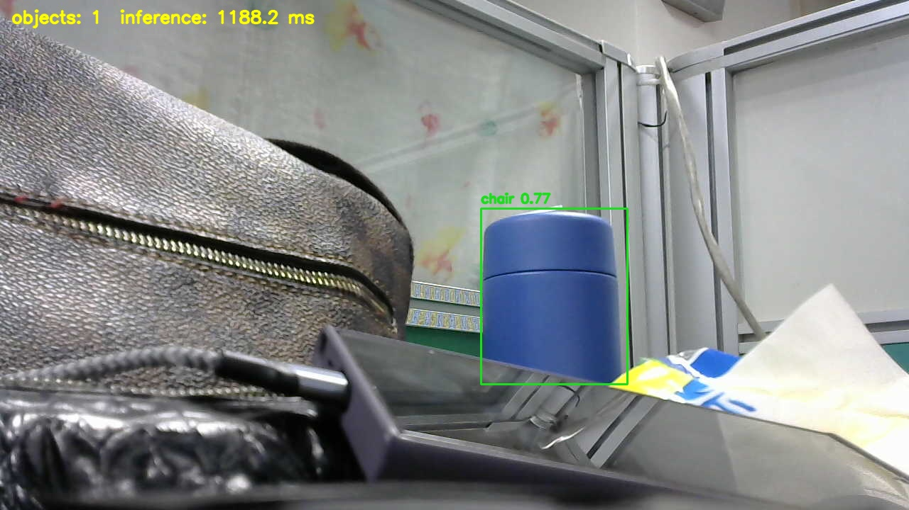

# Jetson Object Stream

Real-time object detection for NVIDIA Jetson devices using Ultralytics YOLO, OpenCV, TensorRT model variants, and an optional browser MJPEG stream.

The repository is organized as source code first. Model engines, private camera captures, logs, and benchmark outputs are generated locally and ignored by Git so the project can be uploaded to a personal GitHub repository without bundling private machine artifacts.

## Project Layout

```text
object_stream/
  live_view.py          # OpenCV live view with object detection
  web_server.py         # MJPEG browser stream
  model_variants.py    # ONNX/TensorRT export and model benchmark helpers

tools/
  benchmark_models.py
  benchmark_camera_matrix.py
  build_tensorrt_engine.py
  capture_public_image.py
  probe_camera.py

docs/assets/           # public-safe images used by README/GitHub pages
models/                # local model outputs, ignored by Git
captures/              # private/local camera images, ignored by Git
logs/                  # runtime CSV/JSON logs, ignored by Git
reports/               # private/local reports, ignored by Git
benchmarks/            # generated benchmark outputs, ignored by Git
```

## Setup

On Jetson, use the install script. It creates a virtual environment with access to JetPack's system OpenCV and installs the Jetson PyTorch wheels.

```bash
./install_jetson.sh
source .venv/bin/activate
python -m pip install -e .
```

Check CUDA from the same environment:

```bash
python - <<'PY'
import torch

print(torch.__version__)
print(torch.cuda.is_available())
PY
```

## Live View

Run a local OpenCV window:

```bash
python -m object_stream.live_view \
  --source 0 \
  --backend v4l2 \
  --model models/yolo11n-320-trt-fp16.engine \
  --imgsz 320 \
  --width 640 \
  --height 480 \
  --fps 30 \
  --fourcc YUYV \
  --auto-exposure 1 \
  --exposure 300 \
  --conf 0.25
```

Use async display when the camera should keep drawing frames while inference runs in the background:

```bash
python -m object_stream.live_view \
  --source 0 \
  --backend v4l2 \
  --model models/yolo11n-320-trt-fp16.engine \
  --imgsz 320 \
  --width 1280 \
  --height 720 \
  --fps 30 \
  --fourcc auto \
  --auto-exposure 1 \
  --exposure 300 \
  --conf 0.25 \
  --async-display
```

Press `q`, `Esc`, or `Ctrl+C` to stop.

By default the app detects every class supported by the selected YOLO model. To limit detection to specific class IDs, pass `--classes`, for example `--classes 0 56 62`.

## Browser Stream

Serve the annotated stream over HTTP:

```bash
python -m object_stream.web_server \
  --host 0.0.0.0 \
  --port 8080 \
  --source 0 \
  --backend v4l2 \
  --model models/yolo11n-320-trt-fp16.engine \
  --imgsz 320 \
  --width 1280 \
  --height 720 \
  --fps 30 \
  --fourcc auto \
  --auto-exposure 1 \
  --exposure 300 \
  --conf 0.25
```

Open the stream from another device on the same network:

```text
http://<jetson-ip>:8080/
```

Status and snapshots are available at:

```text
http://<jetson-ip>:8080/status.json
http://<jetson-ip>:8080/snapshot.jpg
http://<jetson-ip>:8080/video.mjpg
```

## Public Demo Image

Private camera captures stay under `captures/` and are ignored by Git. For a clean image that is safe to show on GitHub, point the camera at a non-sensitive desk scene and save it under `docs/assets/`:

```bash
python -m tools.capture_public_image \
  --source 0 \
  --backend v4l2 \
  --width 1280 \
  --height 720 \
  --fourcc auto \
  --output docs/assets/desk-detections.jpg
```



## Model Variants

Export YOLO variants:

```bash
python -m object_stream.model_variants export \
  --model yolo11n.pt \
  --variants onnx-fp32 trt-fp16 trt-int8 \
  --imgsz 320 \
  --output-dir models
```

Benchmark variants against the same captured frame set:

```bash
python -m object_stream.model_variants benchmark \
  yolo11n.pt models/yolo11n-320-trt-fp16.engine \
  --source synthetic \
  --imgsz 320 \
  --output-csv benchmarks/benchmark_results.csv
```

Build a TensorRT engine directly from ONNX:

```bash
python -m tools.build_tensorrt_engine \
  --onnx models/yolo11n-320-onnx-fp32.onnx \
  --engine models/yolo11n-320-trt-fp16.engine \
  --fp16
```

## Camera And Benchmark Tools

Probe a USB camera and compare default models:

```bash
python -m tools.probe_camera --source 0 --width 640 --height 480 --fps 30
```

Benchmark several model files on one camera capture:

```bash
python -m tools.benchmark_models \
  --source 0 \
  --width 640 \
  --height 480 \
  --fps 30 \
  --fourcc YUYV \
  --models yolo11n.pt models/yolo11n-320-trt-fp16.engine
```

Benchmark camera size and model combinations:

```bash
python -m tools.benchmark_camera_matrix \
  --source 0 \
  --camera-sizes auto \
  --fps 30 \
  --fourcc YUYV
```

## GitHub Notes

The `.gitignore` keeps local artifacts out of the public repository:

- TensorRT/ONNX/PyTorch model files
- calibration caches
- camera captures
- logs and generated summaries
- benchmark output files
- report images
- company/private report tooling
- private camera captures; only curated images in `docs/assets/` are meant for GitHub
- local virtual environments and Python caches

Before publishing, check what Git would include:

```bash
git init
git status --short
git add .
git status --short
```
